# Основы работы и организации хранения
В этой инструкции пойдёт речь о том, как и где хранить данные, используемые в работе, а также о некоторых корпоративных стандартах при работе над разделам вовлечения и аналитики. Инструкция скорее расчитана на новичков, но может быть полезна и более опытным специалистам.

## Содержание
- [Основы работы и организации хранения](#основы-работы-и-организации-хранения)
	- [Содержание](#содержание)
	- [Работа с Яндекс.Диском](#работа-с-яндексдиском)
		- [Структура папки](#структура-папки)
		- [Несколько важных правил работы с файлами](#несколько-важных-правил-работы-с-файлами)
			- [Правило бойскаута](#правило-бойскаута)
		- [Подключение Яндекс.Диска как сетевого диска](#подключение-яндексдиска-как-сетевого-диска)
			- [Компьютеры на Windows](#компьютеры-на-windows)
			- [Компьютеры на MacOS](#компьютеры-на-macos)
			- [Статусы файлов](#статусы-файлов)
	- [Работа с Adobe InDesign](#работа-с-adobe-indesign)
		- [Работа со стилями абзацев](#работа-со-стилями-абзацев)
		- [Совместная работа в Adobe InDesign](#совместная-работа-в-adobe-indesign)
	- [Работа с геоданными](#работа-с-геоданными)
		- [Работа в QGIS](#работа-в-qgis)
		- [Структура хранения геоданных](#структура-хранения-геоданных)

## Работа с Яндекс.Диском
Приступая к проекту, в первую очередь, необходимо запросить доступ к папке проекта на Яндекс.Диске. Сделать это можно, обратившись к руководителю проекта.  
Яндекс.Диск ограничивает объём загруженных файлов двукратным объёмом диска, который привязан к почте. В случае возникновения такой проблемы, стоит обратиться к руководителю проекта, чтобы тот дал данные для входа в специально созданный аккаунт `disk@mfour.ru`.
### Структура папки
В этом разделе мы будем рассматривать структуру папки для подготовки заявки на конкурс МГиИП как типовую.  
Папка проекта состоит из следующих подпапок:
```
📁 project_folder/
├── 📁 album/                 # Сборка альбома проекта
├── 📁 analytics/             # Материалы по аналитике
├── 📁 arch_project/          # Материалы архитекторов
├── 📁 economics/             # Расчёт ТЭП проекта
├── 📁 final_materials/       # Материалы для заказчика
├── 📁 gis/                   # Геопространственные данные
├── 📁 participation/         # Материалы по вовлечению
├── 📁 photo/                 # Фотографии проекта
│   ├── 📸 выезды/            
│   ├── 📸 от администрации/  
│   └── 📸 архивные/          
├── 📁 source_files/          # Исходные данные
├── 📁 texts/                 # Текстовые материалы
└── 📁 Заявка МГиИП/          # Сборка заявки

```
### Несколько важных правил работы с файлами
- Все файлы лучше называть так, чтобы любой человек мог понять, что это за файл и для чего он используется.
- При работе в папках всегда стоит создавать отдельную подпапку `archive`, в которую будут перемещаться неактуальные материалы.
- При создании нескольких версий одного файла лучше использовать название, доступно объясняющее разницу между версиями. Например, `2024-04-01_filename.indd` или `filename_with_economics.indd`.
- Если в названии файла есть дата, она должна быть в формате `YYYY-MM-DD`, то есть год четырьмя цифрами, месяц двумя цифрами со значащим нулём и день двумя цифрами со значащим нулём. Например, `2024-01-13`. Такой формат позволяет корректно сортировать файлы и папки по названию.
- В некоторых случаях zip-архивы, созданные на компьютерах c MacOS, могут неправильно открываться на компьютерах с Windows. Поэтому лучше направлять отдельными файлами, а не zip-архивом. При распаковке на Windows можно пользоваться [WinRAR](https://www.win-rar.com/)
- Лучше включить отображение скрытых файлов и расширений файлов.   
На компьютерах с Windows для этого нужно в верхней панели проводника нажать «Вид» и поставить галочки у пунктов «Расширения имён файлов» и «Скрытые элементы».  
На компьютерах с MacOS для отображения расширений нажать на «Finder» → «Настройки». В появившемся окне выбрать «Дополнительно» и поставить там галочку у пункта «Показывать все расширения имён файлов».  

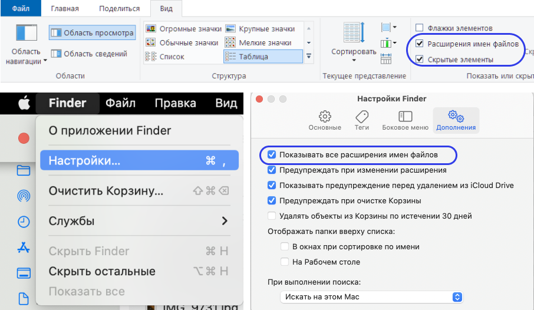

Для отображения скрытых элементов на компьютере с MacOS нужно в терминале ввести команду 
```
defaults write com.apple.finder AppleShowAllFiles -boolean true ; killall Finder
``` 
Для отключения этого режима можно использовать команду 
```
defaults write com.apple.finder AppleShowAllFiles FALSE ; killall Finder`
```
Или же можно использовать сочетание клавиш `⌘ + ⇧ +.` (cmd+shift+точка), но это будет работать только в той директории, в которой сочетание применено.

#### Правило бойскаута
В своей книге [«Чистый код»](https://pakpakych.ru/media/uploads/2021/10/chistyi-kod-sozdanie-analiz-i-refaktoring-by-robert-martin-z-lib-org.pdf) Роберт Мартин ссылается на одно из правил бойскаутов, которое применимо и к работе с общими данными и кодом:  
> Оставь место стоянки чище, чем оно было до твоего прихода.  

### Подключение Яндекс.Диска как сетевого диска
Для более удобной работы с Яндекс.Диском следует подключить его как сетевой диск.  

#### Компьютеры на Windows
1. Нужно [скачать](https://360.yandex.ru/disk/download/) десктопное приложение Яндекс.Диска для Windows 
2. После скачивания запускаем приложение, ему потребуется несколько минут, чтобы установиться
3. После установки откроется окно авторизации. Вводим там данные аккаунта, который используется как основной при работе с диском

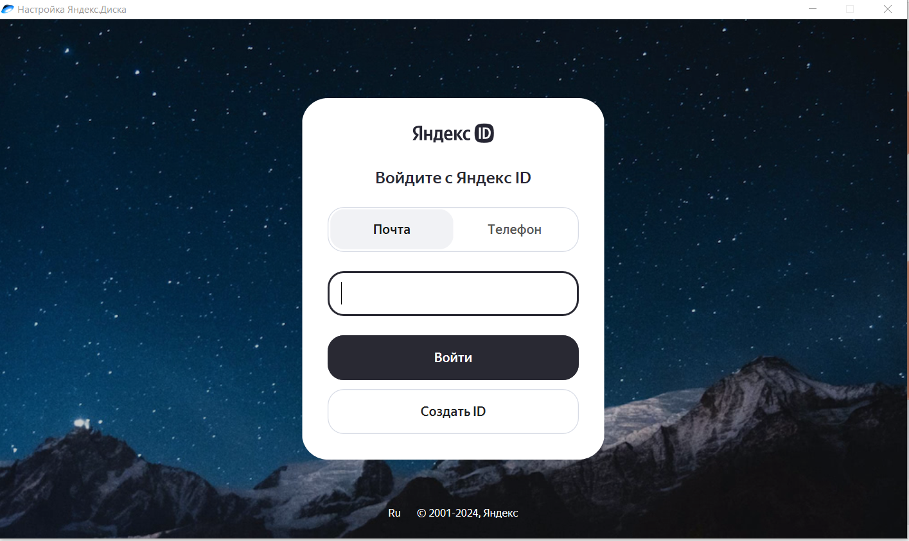

4. После успешной авторизации Яндекс.Диск предложит подключить автосохранение папок. По сути это вариант бэкапа и это можно сделать для локальных папок на компьютере

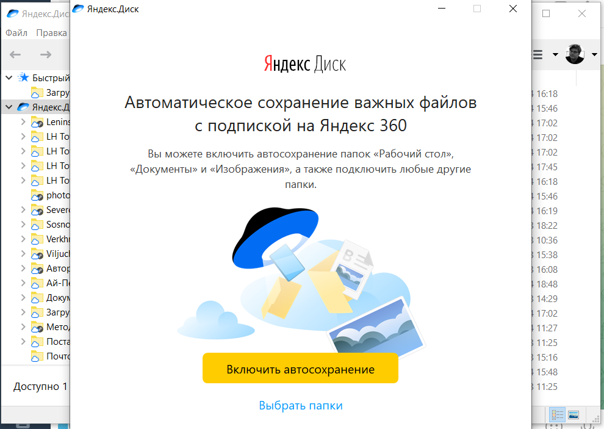

5. Чтобы понять, куда по умолчанию сохраняются данные с Яндекс.Диска, заходим в «Файл» → «Настройки»

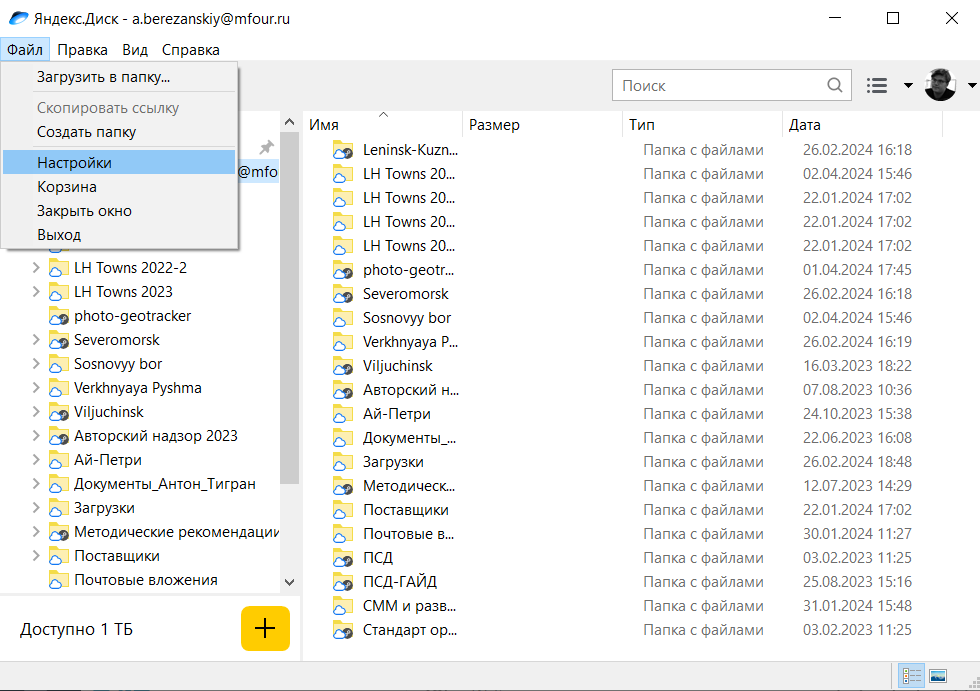

6. Откроется окно, в котором нужно нажать «Настроить расположение папок»

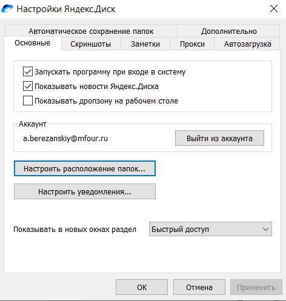

7. В появившемся окне можно увидеть, куда будут сохраняться материалы с Яндекс.Диска при синхронизации. При необходимости можно изменить значения по умолчанию.

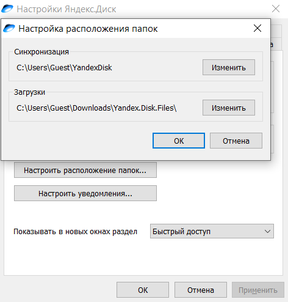

8. Для работы с файлами из папки на Яндекс.Диске как с обычнми файлами нажать правой кнопкой мыши на папку или файл и выбрать «Сохранить на компьютере»

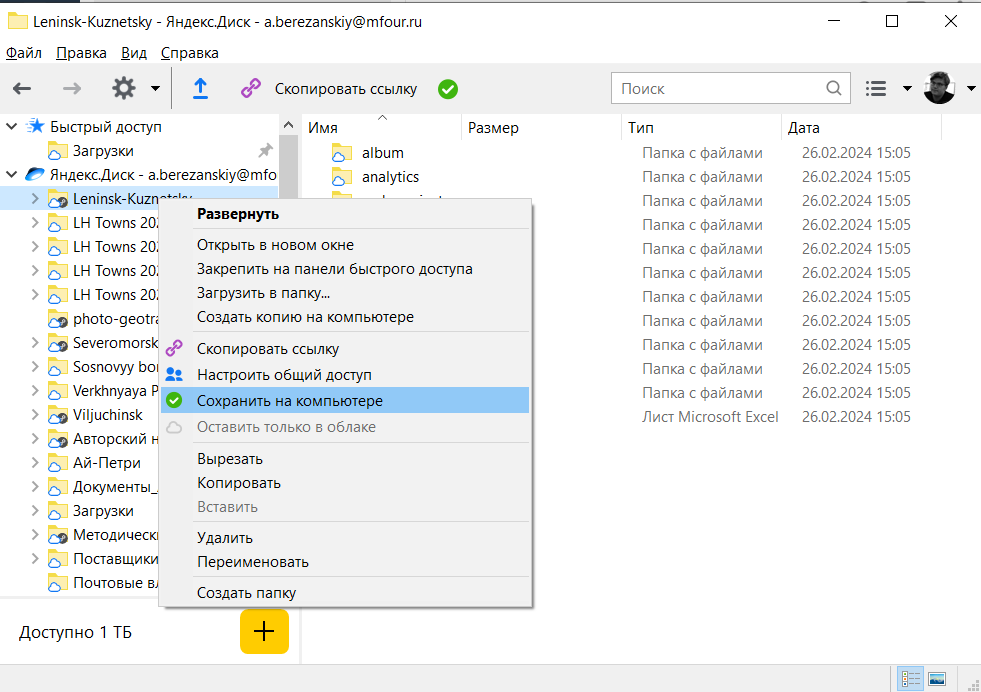

9. Теперь можно работать с файлами с Яндекс.Диска как с обычными, в том числе и в различных программах (например, QGIS или Adobe InDesign).  

#### Компьютеры на MacOS
1. Нужно [скачать](https://360.yandex.ru/disk/download/) десктопное приложение Яндекс.Диска для MacOS 
2. После скачивания запускаем приложение, ему потребуется несколько минут, чтобы установиться, добавляем его в приложения  
3. После установки откроется окно авторизации. Вводим там данные аккаунта, который используется как основной при работе с диском

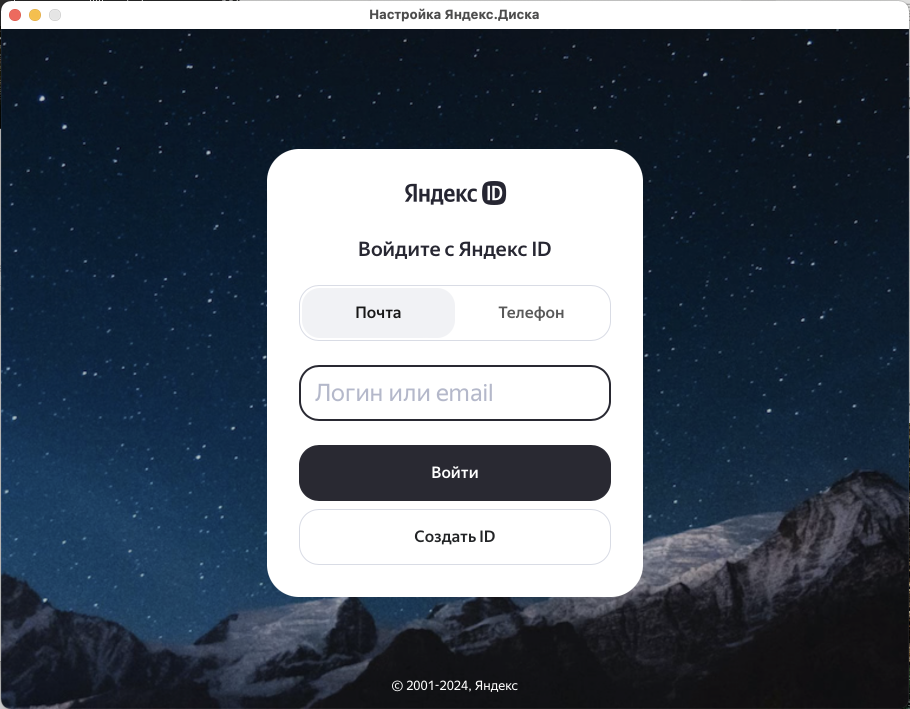

4. Чтобы понять, куда по умолчанию сохраняются данные с Яндекс.Диска, заходим в «Яндекс Диск» → «Настройки»

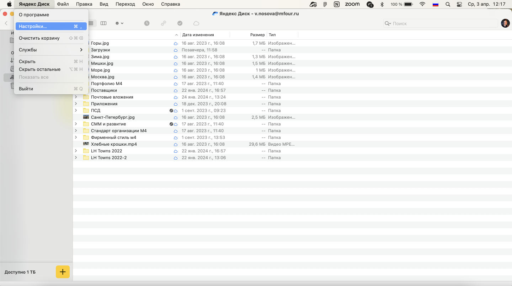

5. Откроется окно, в котором нужно нажать «Настроить расположение папок»

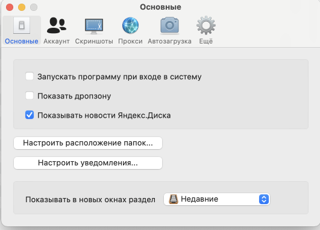

6. В появившемся окне можно увидеть, куда будут сохраняться материалы с Яндекс.Диска при синхронизации. При необходимости можно изменить значения по умолчанию.

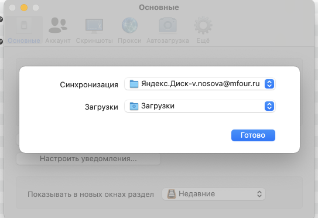

7. Для работы с файлами из папки на Яндекс.Диске как с обычнми файлами нажать правой кнопкой мыши на папку или файл и выбрать «Сохранить на компьютере»

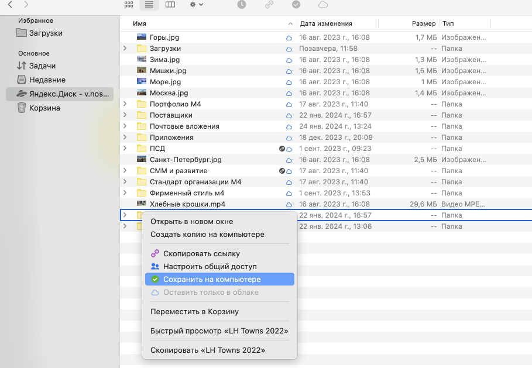

8. Теперь можно работать с файлами с Яндекс.Диска как с обычными, в том числе и в различных программах (например, QGIS или Adobe InDesign).

#### Статусы файлов
При использовании Яндекс.Диска как сетевого используются следующие обозначения статусов файлов:
Символ | Значение
:---:|---
 | Файл или папка хранится на компьютере
 | Содержимое папки частично хранится на компьютере
 | Идет синхронизация
 | Файл или папка хранится только в облаке
 | Состояние синхронизации неизвестно
 | Ошибка синхронизации


## Работа с Adobe InDesign

В отличие от, например, PowerPoint, в котором внешние файлы сохраняются внутри самого файла, в файле проекта InDesign используются ссылки на внешние файлы. В связи с этим необходимо сохранять файлы так, чтобы была возможность использования файла проекта другим человеком.  
Как известно, всё уже придумали до нас, поэтому лучшим вариантом хранения материалов при работе в Adobe InDesign является структура, которую создаёт сам InDesign при «упаковке». 
 
Разберём подробнее:
- `YYYY-MM-DD_filename.indd` — файл проекта. Важно — открываться он будет только в тех версиях InDesign, которые не старше, чем та, в которой его создали
- `YYYY-MM-DD_filename.idml` — файл проекта без некоторых некритических функций. Его можно открыть даже в более старой версии InDesign
- `fonts` — папка, в которой хранятся все шрифты, используемые в проекте. Всегда лучше положить лишний файл, чем недоложить нужный, поэтому лучше туда складывать даже распространённые шрифты типа Arial.
- `links` — папка, в которой хранятся т. н. «линки». То есть файлы, на которые ссылается проект.
	- `arch_project`, `template`, `analytics` и т. д. — папки, в которых хранятся материалы, на которые ссылается проект, разбитые по разделам.

Важно помнить, что, если отправлять другому человеку только INDD- или IDML-файл, то у адресата откроется проект без внутреннего наполнения (точнее — только с текстами).  

### Работа со стилями абзацев
Для удобства работы с альбом при последующей сборке и в случае изменения визуальных решений следует использовать стили абзацев.  
Чтобы иметь удобный доступ к палитре стилей абзацев, следует выбрать режим рабочего пространства «Дополнительно».  

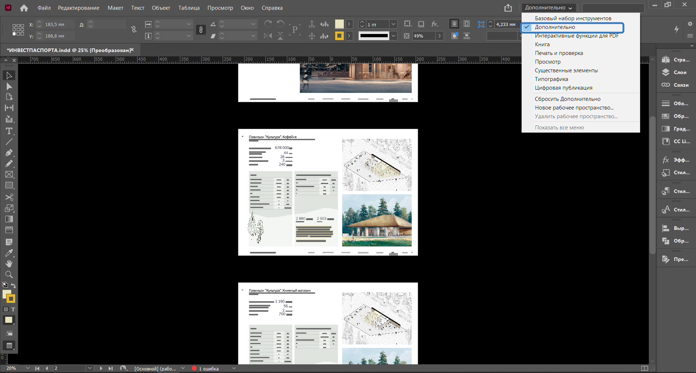

После этого в правой панели появится палитра «Стили абзацев». При нажатии открывается окошко, в котором нужно выбирать предварительно настроенные стили.   
Подборкой стилей обычно занимается ведущий архитектор. Не рекомендуется менять что-либо в стилях абзацев или как-то отдельно при работе с текстом, то есть лучше использовать то, что было в палитре.  
Также не стоит использовать более одного стиля абзаца в одном текстовом фрейме. Лучше сразу разделять на несколько фреймов.  

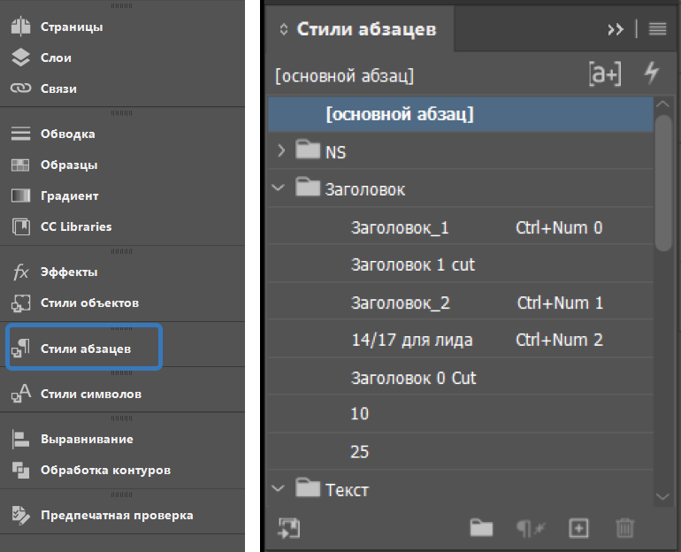

### Совместная работа в Adobe InDesign
Проблема в том, что Adobe InDesign не предназначен для совместной работы. Если два человека откроют один файл в один момент, сохранится версия того человека, который нажал «Сохранить» последним, а результат работы другого исчезнет. Поэтому лучше всего использовать разные файлы для разных людей, называя их, например, по именам работающих в них людей или по датам.  

Если в папке, в которой лежит файл проекта, появляется файл с расширением `.idlk`, то это свидетельствует о том, что кто-то открыл одноимённый файл InDesign.

## Работа с геоданными

### Работа в QGIS
Чаще ввсего для выполнения различных задач по аналитике используется [QGIS](https://qgis.org/ru/site/), поскольку он бесплатен и прост в обращении.   
Для большего удобства как автора проекта, так и тех, кому могут потребоваться файлы из него требуется соблюдать несколько важных правил:
1. Всегда лучше делать бэкапы. QGIS, к сожалению, не самое надёжное ПО, поэтому нередки случаи регулярных крашей проекта. Чтобы избежать потери данных, рекомендуется использовать [плагин](https://plugins.qgis.org/plugins/autoSaver/#plugin-details) для автоматического сохранения
2. Поскольку при работе часто используется большое количество слоёв, лучше всего их называть так, чтобы было понятно, для чего они используется. Например, `town_borders_5000`, где `5000` — это масштаб, для которого настроена визуализация слоя. Лучше использовать наименования латиницей, но необязательно.
3. Слои лучше группировать в зависимости от их назначения и использования для конкретных схем.
4. Настоятельно рекомендуется использовать «темы». Это облегчает работу и автору, и человеку, которые впервые открыл проект и пытается разобраться в нём.   
Чтобы добавить тему нужно нажать на значок глаза в панели слоёв и выбрать «Add theme». В появившемся окне следует назвать тему. Называть лучше так, чтобы было понятно, для какой схемы используется эта тема и в каком масштабе.   
В дальнейшем в лейауте в настройках карты можно выбрать необходимую тему.

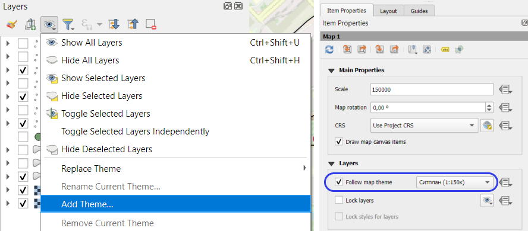

### Структура хранения геоданных
Геоданные — это одна из самых сложных структур для хранения.  
Исходные материалы нужно будет в процессе работы или после неё дублировать в папку `gis` в корневой папке проекта. Или же работать с ней, [подключившись](#Подключение-Яндекс.Диска-как-сетевого-диска) к Яндекс.Диску как к сетевому. Важно помнить, что данные из этой папки могут помочь в будущем другому (или даже тому же) аналитику, поэтому её следует всегда «держать в чистоте».  

Рекомендуется использовать следующую систему хранения внутри этой папки:  
```
📁 project_folder/  
├── 📄 project_name.qgs               # Файл проекта QGIS  
├── 📁 data/                          # Данные проекта  
│   ├── 📁 gisdata/                   # Чистовые данные для QGIS  
│   │   └── 📁 vector_data/           # Векторные данные  
│   │       ├── 📁 basemap/           # Файлы подложки  
│   │       │   ├── 📄 boundary.gpkg  
│   │       │   ├── 📄 highways.gpkg  
│   │       │   └── 📄 ...            
│   │       ├── 📁 public_spaces/     # Тематические наборы  
│   │       ├── 📁 dtp/                 данных  
│   │       └── 📁 .../               
│   ├── 📁 rawdata/                   # Данные для обработки  
│   └── 📁 style/                     # Файлы стилей  
```

Самое главное — это соблдать несколько важнейших правил:
1. Файл проекта QGIS всегда должен храниться на один уровень выше, чем данные слоёв этого проекта;  
2. Файлы должны быть названы так, чтобы любой человек мог понять, что в них хранится;  
3. В названиях файлов и папок, а также в пути к проекту лучше не использовать кириллические символы и пробелы;  
4. Лучше хранить данные в формате GeoPackage, при этом важно корректно и понятно называть слои (см. п. 3 и п. 4). У шейпфайлов достаточно много [недостатков](http://switchfromshapefile.org/), поэтому их лучше не использовать.   
Обратите внимание на то, что в GeoPackage требуется отдельное поле, содержащее уникальные идентификатор (обычно оно называется `fid`). Иногда может получиться так, что у QGIS не получается сохранить файл в формате GeoPackage, поскольку поле `fid` уже существует, что вызывает ошибку. В таком случае можно либо в настройках сохранения (через экспорт, а не через сохранение временного файла) изменить параметр «FID» в «Layer options», либо там же снять выделение с поля `fid` в «Select fields»;   
5. Нельзя забывать про одно из важнейших [правил совместной работы с файлами и данными](#Правило-бойскаута).