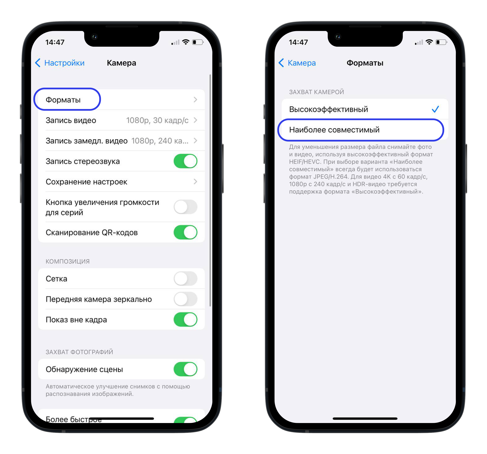
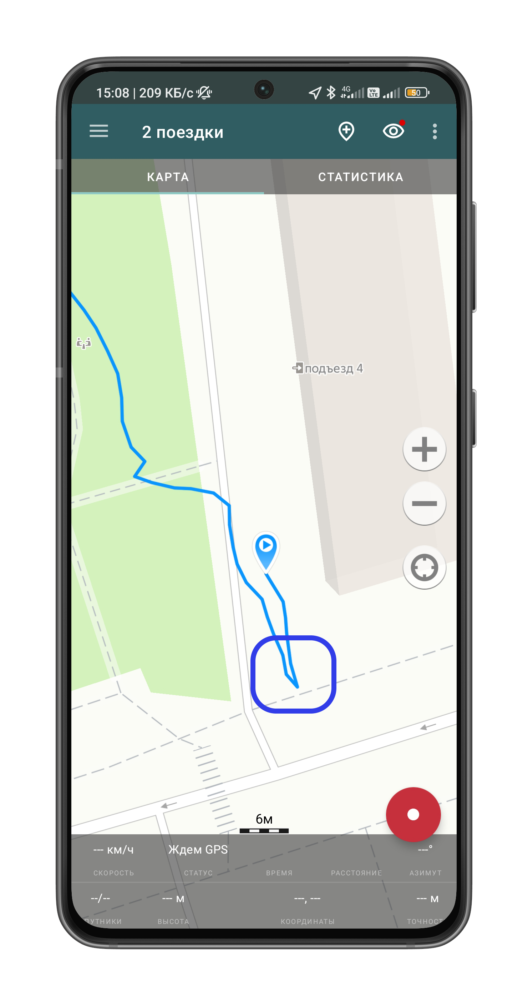

# Запись GPS-трека полевого выхода

В этой инструкции рассказывается про использование геотрекера для нанесения точек фотофиксации на карту.  

## Подготовка к работе  
Перед выходом «в поле» необходимо подготовиться.  

### Подготовка телефона  

#### В случае, если используется iPhone  
1. В первую очередь, необходимо изменить формат сохранения фотографий с HEIC на JPEG. Для этого нужно зайти в настройки камеры, выбрать подпункт «Форматы» и там выбрать «Наиболее совместимый».  
  

2. Затем необходимо скачать приложение для записи GPS-трека. Можно выбрать любое, например, [это](https://apps.apple.com/ru/app/open-gpx-tracker/id984503772). Главное, чтобы была возможность экспорта трека в формате [GPX](https://ru.wikipedia.org/wiki/GPX).  

#### В случае, если используется смартфон на Android   
Необходимо скачать приложение для записи GPS-трека. Можно выбрать любое, например, [это](https://geo-tracker.org/ru). Главное, чтобы была возможность экспорта трека в формате [GPX](https://ru.wikipedia.org/wiki/GPX). Важно дать приложению разрешения на работу с геолокацией и разрешить приложению работать в фоновом режиме.    

### Подготовка себя
Самое главное — не забыть тепло одеться и надеть удобную обувь, а также взять пауэрбанк. Если предстоит выход в лесные массивы, то важно надеть что-то яркое и взять запас воды.  

## Работа в поле
Запись трека нужно производить со включёнными мобильным интернетом и геолокацией. Перед началом сбора данных необходимо «поймать» спутники (может занять некоторое время). Это лучше делать на открытом пространстве.   
Несколько важных моментов:
- Телефон лучше держать в руках и не класть, например, в сумку;  
- В крытых помещениях трек может записываться некорректно. После выхода из них (включая внеуличные переходы) нужно удостовериться, что запись трека идёт корректно;  
- При использовании фотоаппарата, нужно убедиться, что время выставлено достаточно точно;   
- Лучше не фотографировать объекты, расположенные на удалении (например, на другом берегу реки). В идеале, чтобы максимальное расстояние между вами и фотографируемым объектом не превышало 7–10 метров;  
- Лучше не фотографировать детей, детские площадки, сотрудников различных ведомств и объекты, расположенные на закрытых территориях — это может привлечь лишнее внимание и неприятные разбирательства.  

### Контрольная фотография
Перед выходом на основной маршрут лучше всего отойти на расстояние 10–15 метров со включённым трекером и сделать любую фотографию, по которой можно будет однозначно интерпретировать её назначение. Это понадобится в дальнейшем для сопоставления маршрута и фотографий.  

