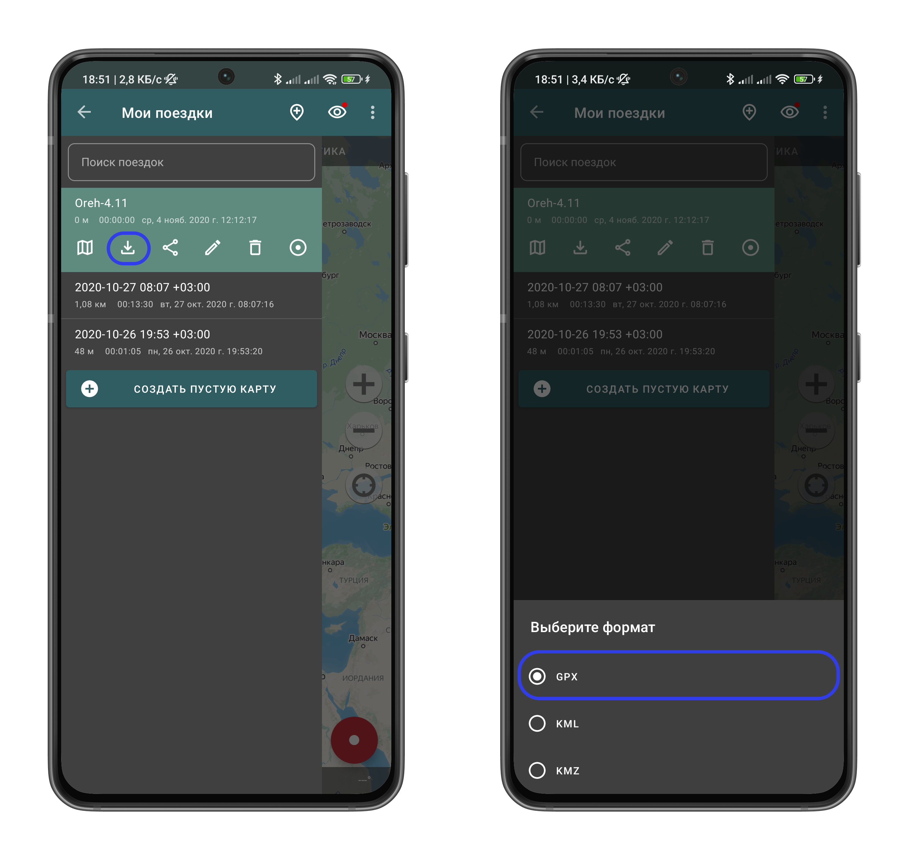
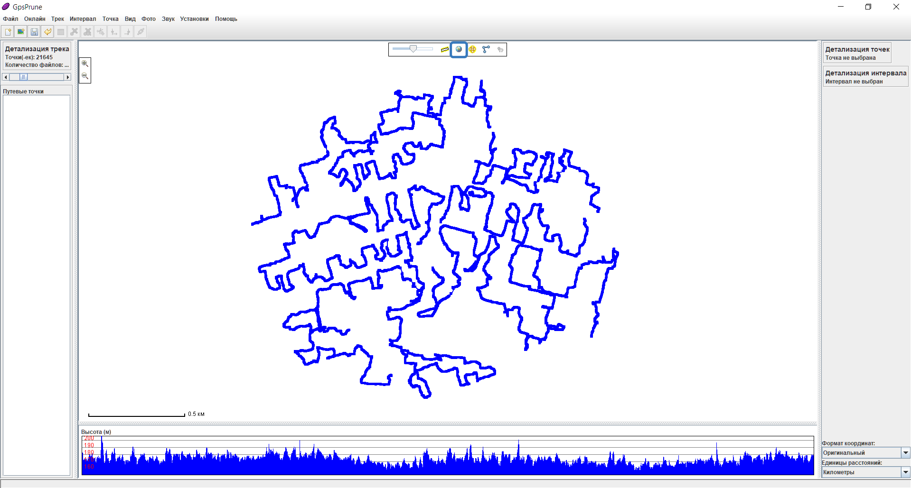

# Запись GPS-трека и совмещение с ним фотографий

В этой инструкции рассказывается про использование геотрекера для нанесения точек фотофиксации на карту.  

## Подготовка к работе  
Перед выходом «в поле» необходимо подготовиться.  

### Подготовка телефона  

#### В случае, если используется iPhone  
1. В первую очередь, необходимо изменить формат сохранения фотографий с HEIC на JPEG. Для этого нужно зайти в настройки камеры, выбрать подпункт «Форматы» и там выбрать «Наиболее совместимый».  
  

2. Затем необходимо скачать приложение для записи GPS-трека. Можно выбрать любое, например, [это](https://apps.apple.com/ru/app/open-gpx-tracker/id984503772). Главное, чтобы была возможность экспорта трека в формате [GPX](https://ru.wikipedia.org/wiki/GPX).  

#### В случае, если используется смартфон на Android   
Необходимо скачать приложение для записи GPS-трека. Можно выбрать любое, например, [это](https://geo-tracker.org/ru). Главное, чтобы была возможность экспорта трека в формате [GPX](https://ru.wikipedia.org/wiki/GPX). Важно дать приложению разрешения на работу с геолокацией и разрешить приложению работать в фоновом режиме.    

### Подготовка компьютера  
Для последующей обработки трека и совмещения с ним фотографий потребуется установить приложения для просмотра GPS-треков и изменения EXIF-данных:  
- [GPS Prune](https://activityworkshop.net/software/gpsprune/download.html) — программа для просмотра и редактирования GPS-треков. Программа требует установленной [Java](https://www.java.com/ru/download/manual.jsp);  
- [ExifTool](https://exiftool.org/) — программа для просмотра и редактирования [EXIF-данных](https://ru.wikipedia.org/wiki/EXIF) файлов.  

Можно воспользоваться [этим архивом](https://disk.yandex.ru/d/4K5OHIofHkxWwg) или скачать программы самостоятельно. **Главное распаковать обе программы в одну папку**.

После установки лучше проверить, что всё установилось корректно.  
Открываем GPS Prune и заходим в «Установки» → «Установить пути к программам».   

В появившемся окне нужно проверить, что программа нашла путь к ExifTool. После нажатия на кнопку «Проверка» должен появиться статус «Да». Если этого не произошло, необходимо скопировать путь к программе (включая `exiftool.exe` и вставить его в соответствующее поле.

  

> В случае использования MacOS необходимо установить соответствующую версию на [сайте](https://exiftool.org/) и прописать в пути к ExifTool `/usr/local/bin/exiftool`

### Подготовка себя
Самое главное — не забыть тепло одеться и надеть удобную обувь, а также взять пауэрбанк. Если предстоит выход в лесные массивы, то важно надеть что-то яркое и взять запас воды.  

## Работа в поле
Запись трека нужно производить со включёнными мобильным интернетом и геолокацией. Перед началом сбора данных необходимо «поймать» спутники (может занять некоторое время). Это лучше делать на открытом пространстве.   
Несколько важных моментов:
- Телефон лучше держать в руках и не класть, например, в сумку;  
- В крытых помещениях трек может записываться некорректно. После выхода из них (включая внеуличные переходы) нужно удостовериться, что запись трека идёт корректно;  
- При использовании фотоаппарата, нужно убедиться, что время выставлено достаточно точно;   
- Лучше не фотографировать объекты, расположенные на удалении (например, на другом берегу реки). В идеале, чтобы максимальное расстояние между вами и фотографируемым объектом не превышало 7–10 метров;  
- Лучше не фотографировать детей, детские площадки, сотрудников различных ведомств и объекты, расположенные на закрытых территориях — это может привлечь лишнее внимание и неприятные разбирательства.  

### Контрольная фотография
Перед выходом на основной маршрут лучше всего отойти на расстояние 10–15 метров со включённым трекером и сделать любую фотографию, по которой можно будет однозначно интерпретировать её назначение. Это понадобится в дальнейшем для сопоставления маршрута и фотографий.  

## Обработка полученных данных

### Выгрузка GPS-трека
Для дальнейшей работы необходимо выгрузить полученный трек в формате GPX. Ниже представлены инструкции по использованию геотрекеров, рекомендованных [выше](#Подготовка-телефона). После проделанных манипуляций нужно отправить материалы на компьютер.  

#### Android
Необходимо выбрать нужный трек и нажать кнопку «Скачать», выбрать место для сохранения и затем выбрать формат GPX.  

  

#### iPhone
Необходимо выбрать нужный трек, нажать на него и выбрать «Поделиться», отправив, например, себе в телеграме GPX-файл.  

  

### Сохранение фотографий
Важно сохранить фотографии как файлы, поэтому, если скидывать себе, например, в телеграм, нужно обязательно выбрать «Отправить как файл».  

### Добавление трека в GPS Prune
> Перед добавлением, на всякий случай, следует создать копию папки, в которой лежат треки.   

Для добавления трека нужно нажать на «Файл» → «Открыть файл».   

  

В открывшемся окне нужно выбрать расположение, в котором находятся треки, выбрать тип файлов «GPX файлы», выбрать все необходимые файлы и нажать «Open».  

  

В результате трек добавится в программу. 

  

Чтобы было проще ориентироваться, стоит включить подложку, нажав на изображение глобуса в верхней части экрана.  

  

### Добавление фотографий в GPS Prune
> Перед добавлением, на всякий случай, следует создать копию папки, в которой лежат фотографии.   

Для добавления фотографий нужно нажать на «Файл» → «Добавить фото».  

  

В открывшемся окне нужно выбрать расположение, в котором находятся фотографии, выбрать тип файлов «JPG файлы», выбрать все необходимые файлы и нажать «Open».  

  

После добавления в левой части экрана будут показаны все добавленные фотографии, а в правой — выбранная фотография.  

  

### Сопоставление фотографий с треком
После добавления трека и фотографий выбираем на треке точку, которая расположена в стороне от основного трека и фотографию, сделанную на ней. Об необходимости создания подобной фотографии написано [выше](#Контрольная-фотография).  

  

Затем нажимаем «Фото» → «Прикрепить к точке».  

  

Прикреплённая фотография будет помечена символом `*`.  
Далее необходимо нажать «Фото» → «Сопоставить фото по времени».  

  

В появившемся окне нужно выбрать фотографию, по которой происходит сопоставление (в данном случае она единственная), а затем проверить смещение (чаще всего оно правильное) и нажать «Ок».

  

После сопоставления точки на треке, в которых были сделаны фотографии, будут отмечены жёлтым.  

  

> Если становится понятно, что точки привязались неверно, то лучше всего просто выйти из программы, не сохраняя фото. После чего проделать все шаги заново.  

Для сохранения привязки заходим в «Фото» → «Сохранить в Exif».  

  

В появившемся окне проверяем, что все фото отмечены, ставим галочку «Переписать файлы» и нажимаем «Ок».  
> Перед этим действием будет последний шанс сделать резервную копию фотографий на всякий случай.  

  

### Добавление данных в QGIS
Чтобы добавить привязанные фотографии в QGIS нужно в панели инструментов найти инструмент «Import geotagged photos».  
[1] — папка, в которой находятся геопривязанные фотографии;  
[2] — место для сохранения точечного слоя с местами фотографирования;  
[3] — место для сохранения таблицы со списоком фотографий, которые не удалось добавить в точечный слой.  

  
